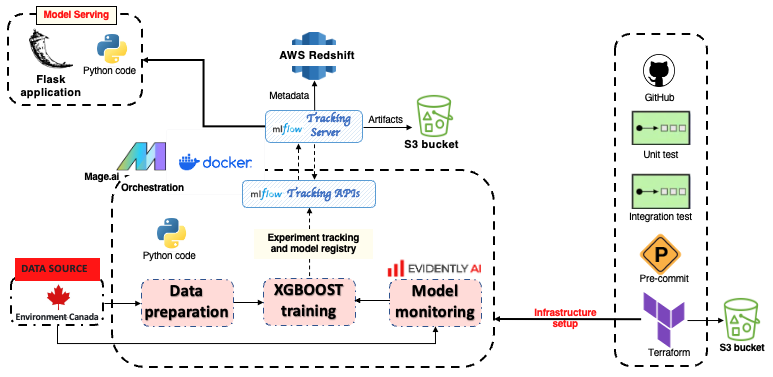
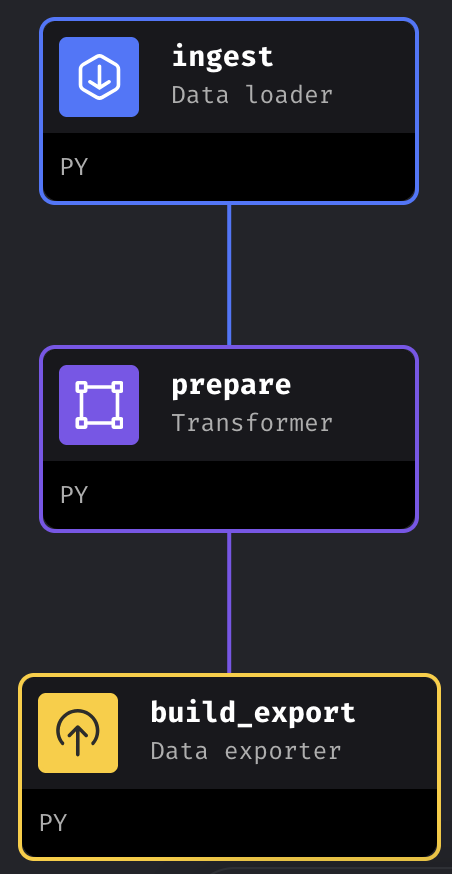
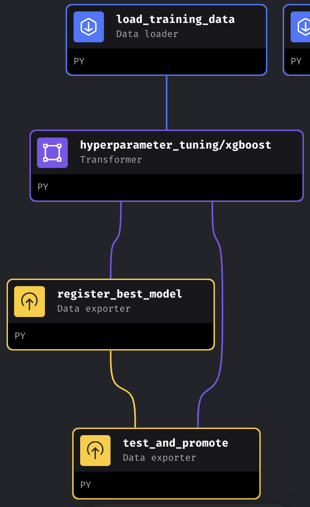
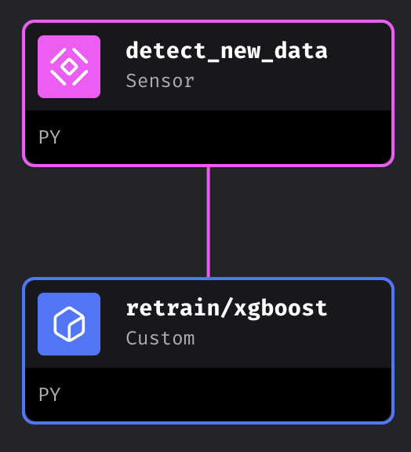
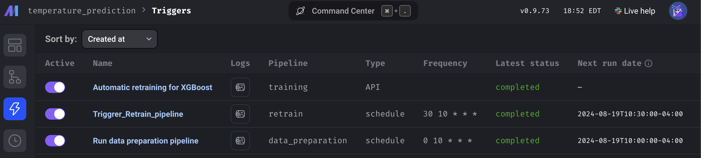
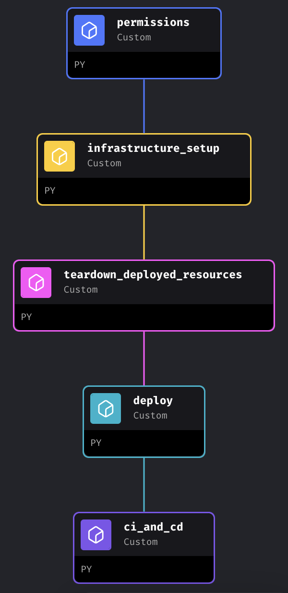
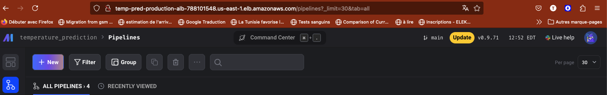

# Temperature-Prediction

[](https://www.python.org/downloads/)
[](https://boto3.amazonaws.com/v1/documentation/api/latest/index.html)
[](https://www.evidentlyai.com/)
[](https://www.mage.ai/)
[](https://flask.palletsprojects.com/en/2.2.x/)
[](https://mlflow.org/)
[](https://hyperopt.github.io/hyperopt/)
[](https://numpy.org/)
[](https://pandas.pydata.org/)
[](https://pypi.org/project/psycopg2/)
[](https://scikit-learn.org/)
[](https://xgboost.readthedocs.io/en/stable/)
[](https://black.readthedocs.io/en/stable/)
[](https://isort.readthedocs.io/en/latest/)
[](https://pre-commit.com/)
[](https://pylint.pycqa.org/en/latest/)
[](https://docs.pytest.org/en/7.2.x/)
<br><br><br>

# Weather Temperature prediction

This repository contains the final project for the [MLOps Zoomcamp](https://github.com/DataTalksClub/mlops-zoomcamp) course provided by [DataTalks.Club](https://datatalks.club/) (Cohort 2024).
The project consists of a **Machine Learning Pipeline**  with Experiment Tracking, Workflow Orchestration, Model Deployment and Monitoring.


- [Project Description](#Project-description)
- [Technologies](#Technologies)
- [Project Architecture](#project-architecture)
    - [(1) Data preparation pipeline (GCS) ](#1-Data-preparation-pipeline)
    - [(2) Training pipeline](#2-Training-pipeline)
    - [(3) Monitoring pipeline](#3-Monitoring-pipleine)
    - [(4) Mage orchestration](#4-Mage-orchestration)
    - [(5) Model deployment](#5-Model-deployment)
    - [(6) MLops best practices](#5-MLops-best-practices)
- [Reproducibility](#reproducibility)
    - [1- Local Setup](#1-local-setup)
    - [2- Cloud Setup](#2-cloud-setup)
- [Further Improvements](#further-improvements)


## Project description
For the Mlops_zoomcamp final project, i choose to implement a simple solution to forecast weather temperature. The main goal is to apply all the skills learnt from the course. So, the emphasis will not be made on the model and the accuracy. We use the data provided by Environment Canada's weather data [https://climate.weather.gc.ca/](https://climate.weather.gc.ca/). We only focus on the weather stations of the province of [Ontario (canada)](https://en.wikipedia.org/wiki/Ontario). There is a jupyter notebook ([Extract_station_data.ipynb](Extract_station_data.ipynb)) explaining how to extract the data related to a station (eg. station id, station name). There is also a python script ([download_stations_id.py](download_stations_id.py)) to download the station data for all canadian provinces and save them in the folder [data/stations/](data/stations/). The notebook [Data_Extraction_and_Cleaning.ipynb](Data_Extraction_and_Cleaning.ipynb) shows how to download weather data for a given station.

## Technologies

| Name | Scope |
| --- | --- |
| Jupyter Notebook | Exploratory data analysis|
| Docker | Application containerization|
| Docker-Compose | Multi-container Docker applications definition and running|
| Mage.ai| Workflow orchestration and pipeline notebooks |
| MLFlow | Experiment tracking and model registry|
| PostgreSQL RDS| MLFLow backend entity storage and Terraform backend|
| Flask | Web server |
| EvidentlyAI | ML models evaluation and monitoring |
| pytest | Python unit testing suite |
| pylint | Python static code analysis |
| black | Python code formatting |
| isort | Python import sorting |
| Pre-Commit Hooks | Code issue identification before submission |
| GitHub Actions | CI/CD pipelines |

## Project architecture


## 1 Data preparation pipeline

We only used two features namely `Date/Time (LST)` and `stationID` and the goal is to predict `Temp (°C)`.



## 2 Training pipeline

We used Xgboost as regression model. We track the experiment with mlfow and register the model having the best score. In the `test_and_promote` block, we compared the registred model with the previous and promote it to production stage if it is the best model.



## 3 Monitoring-pipleine

When a new data is available in the system, we run evidently to check any "Column Drift" or "Dataset Drift". When a drift is observed, we retraining the model with the old and new data.



## 4 Mage orchestration

We orchestrate our pipelines with Mage.ai



## 5 Model deployment

We choose a web service based on flask to deploy our model. Firstly, the code will fetch the model available in mlflow production stage  and make a prediction. We containerize the code with docker and it can be deploy on AWS ECS by running in the terminal the following command: `cd model_web_service` followed by `make scratch_deploy`.

> [!NOTE]
> We don't use the s3 as backend for terraform for the web service deployment. So the terraform state file will be stored locally

## 6 MLops best practices

We make for the web service:
- unit test and integration test
- pylint, black and isort were used to enhance code quality
- make file is written to automatically run the code and deploy it.
- pre-commit is also used

For the ocherstration in mage:
- In the terminal of mage we run pylint, black and isort were used to enhance code quality.
- make file is written to automatically run the code and deploy it.
- CI/CD is written.


## Reproducibility

Before anything:

1. change the name of `dev.env` in the main folder and in `model_web_service/integration-tests/` by `.env`. In these files, change the values of the environment variables after the comment `# ======= To change ========`.

2. Put your `AWS_SECRET` in `dev.secret` and change the filename to `.secret`.

3. Remove the `_` from the name of the file `._docker_password.txt` and write in the file your docker password.

### 1 Local setup
1. Set up mlflow server on Aws EC2 by following this [instruction](mlflow_on_aws.md) with S3 bucket as artifact storage and RDS postgres as backend.

You can set up mlflow locally by:
* installing first mlflow: `pip install mlflow` or `conda install -c conda-forge mlflow`.
* running `mlflow ui --backend-store-uri sqlite:///mlflow.db`
*  Change in the file `temperature_prediction/utils/logging.py`:
  - `DEFAULT_TRACKING_URI` set to `http://127.0.0.1:5000`

2.  In the main project directory, run `make run-local` to launch Mage.
3.  You can leave the data present in `data/Training/old/` and run the `training pipeline`. You can also delete these data and start from scratch by running the `data preparation` pipeline following by the `training pipeline`. For the ochestration, i suggest to follow my setting:
    - run the `data preparation` pipeline eah day at any hour of your choice
    - run the `retrain` pipeline 30 min after the time you set for the `data preparation` pipeline.
4. In the terminal `cd model_web_service` and `make run-local` to launch the web-service.

5. To get a new prediction run:

```console
curl --header "Content-Type: application/json" \
  --request POST \
  --data '{"Station ID": 50840, "Date/Time (LST)": "2024-08-09 23:00:00"}' \
  http://localhost:9696/predict`
```


### 2  Cloud setup

1. Set up mlflow server on Aws EC2 by following this [instruction](mlflow_on_aws.md) with S3 bucket as artifact storage and RDS postgres as backend.

2. In the main project directory, run `make run-local` to launch Mage and run the pipeline `deploying_to_production`. This will create two users `MageDeployer` and `MageContinuousIntegrationDeployer`. The first will have the grants to deploy Mage the second one will be used in CI/CD configuration. Running the pipeline will deploy mage on aws ECS but it will not contain your project. By committing the project on github it'll run the github actions and put the new image Aws ECR. Normally, all the pipelines should be there.





> [!WARNING]
> Unfortunately, the pipelines don't appear in the mage (for me). But we can clone the repository in the `control version` panel.

Another way of publishing Mage, is to run the block `permissions` of the pipeline `deploying_to_production`. It will create the user `MageDeployer`. Use its credentials in the `.env` and `.secret` and then run `make scratch_deploy`. Use the `load balancer DNS` given to load mage.




3. To deploy the web service, in the terminal, cd in `cd model_web_service` and run `make scratch_deploy`.

4. To get a new prediction run:

```console
curl --header "Content-Type: application/json" \
  --request POST \
  --data '{"Station ID": 50840, "Date/Time (LST)": "2024-08-09 23:00:00"}' \
  http://the_balancer_output/predict`
```


> [!WARNING]
> Be sure to give the requiered policy to s3 bucket (for mlflow artifact and Terraform state.)


# Further-improvements
1. Run unit test on each block and each pipeline used in Mage.
2. Run integration test for the code in Mage
3. Do the CI/CD for the web_service. Improve the CI/CD of mage so that the pipelines will automatically appear.

4. Build a streamlit client for an easy interaction
5. Use Graphana and Promotheus to visualize and keep track of the metrics provided by evidently.
